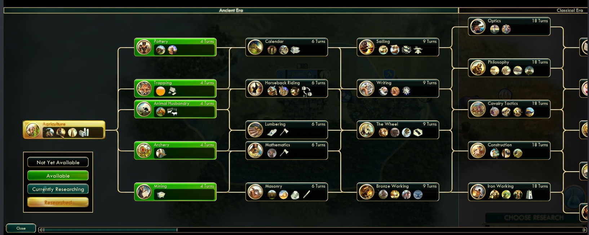

# Table of Contents

1.  [Description](#orgbfcb891)
    1.  [Target audience](#org37c8554)
2.  [Data sources](#orged53c2f)
    1.  [org-roam files](#orgbf08858)
3.  [Logic of middleware](#orga0314a4)
    1.  [Parsing org roam files](#org1fea91b)
    2.  [Сurrent backlog](#orgea0aa61)
    3.  [Datomic and datalog](#orgbde6458)
        1.  [Query on Datomic side](#org2a62538)
        2.  [Generating json](#orgb0d1673)
4.  [Front-end](#org165f9b6)
    1.  [Node description](#org395dcb2)
        1.  [functionality in order of priority](#orge34f4be)
        2.  [content of node](#orge86ea76)
    2.  [Outline of canvas for chain of events](#org9263798)

# Description

The project is inspired by Sid Meyer's Civilization tech tree

the goal is to make similar directed graph of historical events in regard of:

-   technology
-   science
-   art
-   policy
-   urban management
-   &#x2026;

and to make it interactive, editable using:

-   web app
-   plain text files

and enable support of AI agents

so it will ease reasoning about

-   what are pre-requirements for establishing
    -   institution,
    -   particular technology,
    -   &#x2026;
-   what was goals of different countries during event X

by providing helicopter view for chain of historical events before and/or after chosen node
Deeplpy custom queries will be feasible powerfull query engine named Datalog

## Target audience

-   consultants
-   think tank analysts
-   students and researchers

# Data sources

video audio recordings

-   Глазычев "История инженерии"
-   Bushwalker Youtube channel
-   Harrari "Homo Sapience&#x2026;"
-   Diamond "Rifles &#x2026;"

transcribed or converted into org mode text
and then markuped with org-roam nodes by inserting customized org-roam nodes
here is customization code:

    
    ;;;; =========================
    ;;;; 1) Конфиг хранилищ списков
    ;;;; =========================
    
      (defgroup my/org-roam nil
        "Personal org-roam helpers."
        :group 'org)
    
      (defcustom my/roam-tags-default
        '("script" "post" "learn" "contact" "entity" "project")
        "Теги для обычных заметок (template: \"default note\")."
        :type '(repeat string)
        :group 'my/org-roam)
    
      (defcustom my/roam-herodotus-what
        '("tbd" "technology" "institution" "project" "math" "business")
        "Области знаний для заметок Herodotus."
        :type '(repeat string)
        :group 'my/org-roam)
    
      (defcustom my/roam-herodotus-when
        '("tbd" "stone" "copper" "bronze" "iron" "ancient" "classic" "medieval" "renaissance" "industrial" "modern" "atomic" "information")
        "Эпохи для заметок Herodotus."
        :type '(repeat string)
        :group 'my/org-roam)
    
      ;; (defcustom my/roam-who
      ;;   '("tbd" "person" "group")
      ;;   "Личности для заметок Herodotus."
      ;;   :type '(repeat string)
      ;;   :group 'my/org-roam)
    
      (defcustom my/roam-herodotus-where
        '("tbd" "Africa" "Australia" "Japan" "Mesopotamia" "Egypt" "China" "India" "Mesoamerica" "Greece" "Turan" "Europe")
        "Локации для заметок Herodotus."
        :type '(repeat string)
        :group 'my/org-roam)
    
      (defcustom my/roam-herodotus-source
        '("tbd" "Glazychev-History-Of-Engineering" "Harari-Homo-Sapiens" "Bushwalker" "Diamond-Guns-Germs-and-Steel")
        "Локации для заметок Herodotus."
        :type '(repeat string)
        :group 'my/org-roam)
    
    ;;;; =========================
    ;;;; 2) Общая утилита выбора + автосохранение
    ;;;; =========================
    
      (defvar my/roam-vars-file (expand-file-name "my-roam-vars.el" user-emacs-directory)
        "Файл, в котором хранятся списки тегов и классификаций для org-roam.")
    
      (defun my/save-roam-vars ()
        "Сохранить все списки my/roam-* в `my/roam-vars-file`."
        (with-temp-file my/roam-vars-file
          (insert ";; Автоматически сгенерированные списки для org-roam\n\n")
          (dolist (v '(my/roam-tags-default
                       my/roam-herodotus-what
                       my/roam-herodotus-when
                       my/roam-herodotus-where
                       my/roam-herodotus-source))
            (when (boundp v)
              (insert (format "(setq %s '%S)\n" v (symbol-value v)))))))
    
      (defun my/crm-choose-and-remember (prompt var-sym)
        "Спросить несколько значений через completion и запомнить новые в VAR-SYM.
    Возвращает одну строку со значениями, разделёнными пробелом.
    При добавлении новых значений автоматически сохраняет их в `my/roam-vars-file`."
        (let* ((vals (copy-sequence (symbol-value var-sym)))
               (choice (completing-read-multiple prompt vals nil nil)))
          (dolist (x choice)
            (unless (member x vals)
              (setq vals (append vals (list x)))))
          (set var-sym vals)
          ;; сохраняем все списки в файл
          (my/save-roam-vars)
          (mapconcat #'identity choice " ")))
    
      (defun my/org-roam-choose-tags-default ()
        (my/crm-choose-and-remember "Choose tags: " 'my/roam-tags-default))
    
      (defun my/org-roam-choose-what ()
        (my/crm-choose-and-remember "Choose domain: " 'my/roam-herodotus-what))
    
      (defun my/org-roam-choose-when ()
        (my/crm-choose-and-remember "Choose era: " 'my/roam-herodotus-when))
    
      (defun my/org-roam-choose-where ()
        (my/crm-choose-and-remember "Choose location: " 'my/roam-herodotus-where))
    
      (defun my/org-roam-choose-source()
        (my/crm-choose-and-remember "Choose source: " 'my/roam-herodotus-source))
      ;; Загружаем значения при старте Emacs
      (when (file-exists-p my/roam-vars-file)
        (load-file my/roam-vars-file))
    
    
    ;;;; =========================
    ;;;;  функция для Aliases
    ;;;; =========================
    
      (require 'subr-x) ;; для string-trim
    
      (defun my/org-roam-read-aliases ()
        "Спросить алиасы через запятую и вернуть строку для :ROAM_ALIASES:,
    где КАЖДЫЙ алиас заключён в кавычки. Пустой ввод → пустая строка."
        (let* ((input (read-string "Aliases (comma separated): "))     ; пример: Luther, Martin Luther, Printing Press
               (parts (split-string input "," t "[ \t\n]*")))          ; делим по запятой, удаляя пустые
          (if (null parts)
              ""                                                       ; ничего не ввели
            (mapconcat (lambda (a) (format "\"%s\"" (string-trim a)))  ; каждую часть → "…"
                       parts
                       " "))))
    ;;;; =========================
    ;;;; 3) Шаблоны org-roam
    ;;;; =========================
    
      (with-eval-after-load 'org-roam
        (setq org-roam-capture-templates
              '(;; --- default ---
                ("d" "default note" plain
                 "%?"
                 :target (file+head
                          "%<%y%m|%d'%b|%H:%M:%S> - ${slug}.org"
                          ":PROPERTIES:
    :ID: %(org-id-new)
    :TAG: %(my/org-roam-choose-tags-default)
    :END:
    #+title: ${title}
    ")
                 :unnarrowed t)
    
                ;; --- herodotus ---
                ("h" "herodotus" plain
                 "%?\n
    # #+BEGIN_RELATIONS
    # * Leads to
    
    # * Requires
    
    # * Subset of
    
    # * Siblings
    
    #+END_RELATIONS
    "
                 :target (file+head
                          "herodotus/${slug}.org"
                          ":PROPERTIES:
    :ID: %(org-id-new)
    :WHAT: %(my/org-roam-choose-what)
    :WHEN: %(my/org-roam-choose-when)
    :WHERE: %(my/org-roam-choose-where)
    :ROAM_ALIASES: %(my/org-roam-read-aliases)
    :SOURCE: %(my/org-roam-choose-source)
    :END:
    #+title: ${title}
    ")
                 :unnarrowed t))))
    
    
    
      ;; -------org-roam smart insert with region support----------
    
    
      (with-eval-after-load 'org-roam
        (defun my/org-roam-node-insert-smart (orig-fn &rest args)
          "Умное поведение для org-roam-node-insert:
    - если активен регион → заменить его ссылкой [[id:UUID][текст]];
    - если перед курсором [[id: → вставить UUID и закрыть ссылку;
    - если узел не найден → вызвать стандартное поведение (создание ноды);
    - иначе → обычная вставка."
          (cond
           ;; случай 1: выделен регион
           ((use-region-p)
            (let* ((beg (region-beginning))
                   (end (region-end))
                   (region-text (buffer-substring-no-properties beg end))
                   (node (org-roam-node-read)))
              (if (not (org-roam-node-id node))
                  ;; если у выбранного узла нет ID → передаём управление оригинальной функции
                  (apply orig-fn args)
                ;; иначе вставляем ссылку
                (delete-region beg end)
                (insert (format "[[id:%s][%s]]"
                                (org-roam-node-id node)
                                region-text)))))
    
           ;; случай 2: дефолт
           (t
            (apply orig-fn args)))))
    
      (advice-add 'org-roam-node-insert :around #'my/org-roam-node-insert-smart)

as an output we have this:

## org-roam files

# Logic of middleware

## Parsing org roam files

to parse it we have a Clojure code

    
    (ns relations-parser.core
      (:require
       [clojure.string :as str]
       [org-parser.core :as org]
       [clojure.java.io :as io]))
    
    ;; --- санитизация входного текста ---
    
    (def ^:private weird-chars
      [\uFEFF      ;; BOM
       \u00A0      ;; NBSP
       \u200B      ;; ZERO WIDTH SPACE
       \u200C      ;; ZERO WIDTH NON-JOINER
       \u200D      ;; ZERO WIDTH JOINER
       \u2028      ;; LINE SEPARATOR
       \u2029])    ;; PARAGRAPH SEPARATOR
    
    (defn- sanitize-text [s]
      (-> s
          (str/replace #"\r\n?" "\n")                 ;; CRLF/CR -> LF
          (str/replace (re-pattern (apply str weird-chars)) "")  ;; выкинуть странные
          (str/replace #"[ \t]+\n" "\n")))            ;; обрезать хвостовые пробелы
    
    (defn- read-org-safe [path]
      (let [raw (slurp path :encoding "UTF-8")]
        (try
          (org/read-str raw)
          (catch Throwable _
            ;; повторная попытка на санитезированном тексте
            (org/read-str (sanitize-text raw))))))
    ;; ---------- настройка секций блока RELATIONS ----------
    
    (def ^:private section->etype
      {"leads to"  :leads-to
       "requires"  :requires
       "subset of" :subset-of
       "siblings"  :siblings})
    
    ;; ---------- утилиты ----------
    
    (defn- norm-title
      "Склеивает заголовок Org из вектора токенов в строку и нормализует."
      [title-tokens]
      (->> title-tokens
           (map (fn [tok]
                  (cond
                    (vector? tok)
                    (let [[tag s] tok]
                      (if (or (= tag :text-normal)
                              (= tag :text-sty-bold)
                              (= tag :text-sty-italic)
                              (= tag :text-sty-underl))
                        (second tok)
                        ""))
    
                    (string? tok) tok
                    :else "")))
           (apply str)
           str/trim
           str/lower-case))
    
    (defn- headline->etype [h]
      (some-> h :headline :title norm-title section->etype))
    
    (defn- vecwalk
      "Глубокий проход по векторно-дереву токенов, вызывая f на каждом узле."
      [node f]
      (when node
        (f node)
        (when (sequential? node)
          (doseq [x node] (vecwalk x f)))))
    
    (defn- ast-find
      "Возвращает true, если предикат p срабатывает на каком-то узле в AST-векторе."
      [ast p]
      (let [hit? (volatile! false)]
        (vecwalk ast #(when (and (vector? %) (p %)) (vreset! hit? true)))
        @hit?))
    
    (defn- ast-links
      "Извлекает все [[id:...][label]] из section/:ast заголовка."
      [section-ast]
      (let [links (volatile! [])]
        (vecwalk section-ast
                 (fn [node]
                   (when (and (vector? node) (= (first node) :link-format))
                     ;; ожидаем структуру вида:
                     ;; [:link-format [:link [:link-ext [:link-ext-id \"UUID\"]]] [:link-description \"desc\"]]
                     (let [id   (atom nil)
                           desc (atom nil)]
                       (vecwalk node
                                (fn [n]
                                  (when (and (vector? n)
                                             (= (first n) :link-ext-id))
                                    (reset! id (second n)))
                                  (when (and (vector? n)
                                             (= (first n) :link-description))
                                    (reset! desc (second n)))))
                       (when @id
                         (vswap! links conj {:to @id :label @desc}))))))
        @links))
    
    ;; ---------- извлечение свойств документа ----------
    
    (defn- preamble-props
      "Достаёт drawer PROPERTIES из preamble как {:ID .., :WHAT .., ...}."
      [preamble]
      (let [lines (get-in preamble [:section :raw])]
        (->> (when lines
               (->> lines
                    (drop-while #(not= % ":PROPERTIES:"))
                    (rest)
                    (take-while #(not= % ":END:"))))
             (keep (fn [s]
                     (when (str/starts-with? s ":")
                       (let [[_ k & vs] (str/split s #":\s*")
                             k* (when k (-> k str/upper-case keyword))
                             v* (-> (str/join ":" vs) str/trim)]
                         (when (and k* (not= (name k*) "PROPERTIES"))
                           [k* v*])))))
             (into {}))))
    
    
    ;; ---------- выделение title ----------
    
    (defn- extract-title
      "Находит #+title: в преамбуле и извлекает его значение."
      [preamble]
      (let [lines (get-in preamble [:section :raw])]
        (some (fn [line]
                (when (str/starts-with? line "#+title:")
                  (-> line
                      (str/replace #"#\+title:\s*" "") ; Убираем '#+title: '
                      str/trim))) ; Чистим от лишних пробелов
              lines)))
    
    ;; ---------- выделение блока RELATIONS ----------
    
    (defn- relations-present? [preamble-ast]
      (ast-find preamble-ast
                (fn [node] (and (= (first node) :block-begin-line)
                                (= (second node) [:block-name "RELATIONS"])))))
    
    (defn- block-end-in-headline? [h]
      (ast-find (get-in h [:section :ast])
                (fn [node] (and (= (first node) :block-end-line)
                                (= (second node) [:block-name "RELATIONS"])))))
    
    (defn- pick-relations-headlines
      "Возвращает последовательность заголовков, относящихся к первому блоку RELATIONS.
       Эвристика соответствует наблюдаемому выводу org-parser: начало блока в preamble,
       конец — токен :block-end-line в последнем headline секции."
      [{:keys [preamble headlines]}]
      (when (and preamble (relations-present? (get-in preamble [:section :ast])))
        (if (seq headlines)
          (let [[taken _]
                (reduce (fn [[acc done?] h]
                          (if done?
                            [acc true]
                            (let [acc2 (conj acc h)
                                  end? (block-end-in-headline? h)]
                              [acc2 end?])))
                        [[] false]
                        headlines)]
            taken)
          [])))
    
    ;; ---------- публичный API ----------
    
    
    (defn parse-file
      "Читает .org → {:doc/id ... :properties ... :edges ...}"
      [fpath]
      (let [ast     (read-org-safe fpath)
            pre     (:preamble ast) ; Вынесем преамбулу в отдельную переменную
            props   (preamble-props pre)
            title   (extract-title pre) ; <-- ВЫЗЫВАЕМ НОВУЮ ФУНКЦИЮ
            this-id (:ID props)
            rel-hs  (pick-relations-headlines ast)]
        {:doc/id this-id
         :title title
         :properties props
         :edges (->> rel-hs
                     (mapcat (fn [h]
                               (when-let [etype (headline->etype h)]
                                 (let [links (ast-links (get-in h [:section :ast]))]
                                   (for [{:keys [to label]} links :when to]
                                     {:edge/type etype
                                      :from this-id
                                      :to   to
                                      :label label})))))
                     vec)}))
    
    (defn parse-dir
      "Собирает {:doc/id ... :properties ... :edges ...} по всем .org в каталоге (без рекурсии)."
      [dir]
      (->> (file-seq (clojure.java.io/file dir))
           (filter #(and (.isFile ^java.io.File %)
                         (str/ends-with? (.getName ^java.io.File %) ".org")
                         (= (.getParent ^java.io.File %) (-> dir clojure.java.io/file .getPath))))
           (map #(parse-file (.getPath ^java.io.File %)))
           vec))
    
    (defn -main [& [dir]]
      (let [dir (or dir ".")]
        (println (pr-str (parse-dir dir)))))

the purpose of this code is to extract EDN data from org-roam
and it already does
here is sample of this code product, EDN extracts

     [{:doc/id "1FCEB5F3-9448-4C6B-BB5C-061B3943F5A4",
     :title "детская игрушка",
     :properties
     {:ID "1FCEB5F3-9448-4C6B-BB5C-061B3943F5A4",
      :WHAT "technology",
      :WHEN "stone",
      :WHERE "tbd",
      :ROAM_ALIASES "",
      :SOURCE "Glazychev-History-Of-Engineering"},
     :edges
     [{:edge/type :leads-to,
       :from "1FCEB5F3-9448-4C6B-BB5C-061B3943F5A4",
       :to "34D8F06C-597D-4DC0-9D80-0BEC05AC2AB8",
       :label "колесо"}]}
    {:doc/id "EF5CAB5F-DD58-4139-A0FD-8FFB8B911539",
     :title "ковка",
     :properties
     {:ID "EF5CAB5F-DD58-4139-A0FD-8FFB8B911539",
      :WHAT "technology",
      :WHEN "iron",
      :WHERE "tbd",
      :ROAM_ALIASES "\"технология ковки стали\" \"ковка железа\"",
      :SOURCE "Glazychev-History-Of-Engineering"},
     :edges []}
    {:doc/id "DE6586B7-D4B7-4AA6-B13E-B54907F101D5",
     :title "латинский парус",
     :properties
     {:ID "DE6586B7-D4B7-4AA6-B13E-B54907F101D5",
      :WHAT "armory technology logistics",
      :WHEN "classic",
      :WHERE "Rome",
      :ROAM_ALIASES "\"треугольный парус\" \"косой парус\"",
      :SOURCE "Glazychev-History-Of-Engineering"},
     :edges []}
    {:doc/id "0CA18DD3-80BF-4407-8864-315E4D9ACFB0",
     :title "стрелы",
     :properties
     {:ID "0CA18DD3-80BF-4407-8864-315E4D9ACFB0",
      :WHAT "armory",
      :WHEN "tbd",
      :WHERE "tbd",
      :ROAM_ALIASES "\"собственно стрелы\"",
      :SOURCE "Glazychev-History-Of-Engineering"},
     :edges []}
    {:doc/id "835ADE3D-9575-4D8A-93E0-3044A1D3E7BA",
     :title "литературная критика",
     :properties
     {:ID "835ADE3D-9575-4D8A-93E0-3044A1D3E7BA",
      :WHAT "arts",
      :WHEN "bronze",
      :WHERE "Egypt",
      :ROAM_ALIASES "\"архив Амарны\"",
      :SOURCE "Glazychev-History-Of-Engineering"},
     :edges
     [{:edge/type :requires,
       :from "835ADE3D-9575-4D8A-93E0-3044A1D3E7BA",
       :to "C9EA9658-CF4F-4E5D-81F4-9CED79D4FF81",
       :label "абстрактное мышление"}]}
    {:doc/id "D7161DC9-E8CC-4095-8C2C-B0F9281C8928",
     :title "тяжелая ручная мельница",
     :properties
     {:ID "D7161DC9-E8CC-4095-8C2C-B0F9281C8928",
      :WHAT "technology",
      :WHEN "tbd",
      :WHERE "tbd",
      :ROAM_ALIASES "",
      :SOURCE "Glazychev-History-Of-Engineering"},
     :edges
     [{:edge/type :requires,
       :from "D7161DC9-E8CC-4095-8C2C-B0F9281C8928",
       :to "6AE436CD-1099-4D0F-BBDE-69492AFCD2FA",
       :label "ручной жернов"}
      {:edge/type :subset-of,
       :from "D7161DC9-E8CC-4095-8C2C-B0F9281C8928",
       :to "34D8F06C-597D-4DC0-9D80-0BEC05AC2AB8",
       :label "колесо"}]}
    {:doc/id "4653B479-2DB1-4536-AD71-3BE553639369",
     :title "чистые геометрические формы",
     :properties
     {:ID "4653B479-2DB1-4536-AD71-3BE553639369",
      :WHAT "concept math",
      :WHEN "stone",
      :WHERE "tbd",
      :ROAM_ALIASES
      "\"квадрат\" \"круг\" \"горизонтальный прямой угол\" \"абстрактная геометрия жилья\"",
      :SOURCE "Glazychev-History-Of-Engineering"},
     :edges
     [{:edge/type :leads-to,
       :from "4653B479-2DB1-4536-AD71-3BE553639369",
       :to "C9EA9658-CF4F-4E5D-81F4-9CED79D4FF81",
       :label "абстрактное мышление"}
      {:edge/type :leads-to,
       :from "4653B479-2DB1-4536-AD71-3BE553639369",
       :to "B90FCB08-D9EC-4FAD-8F93-05F3734E0F1E",
       :label "стоечно-балочная конструкция"}]}
    {:doc/id "28E27885-4A59-4F4A-8362-067A386A31F9",
     :title "организованная армия",
     :properties
     {:ID "28E27885-4A59-4F4A-8362-067A386A31F9",
      :WHAT "logistics armory",
      :WHEN "bronze",
      :WHERE "Egypt",
      :ROAM_ALIASES "",
      :SOURCE "Glazychev-History-Of-Engineering"},
     :edges []}]

## Сurrent backlog

TO LLLM:
to reduce edge fragmentation this clojure code needs elaboration

-   edges from-to pairs needs to be consedered separately from doc
    -   to be generated separately
    -   since it would be only from-to pairs no need to specify edge type in this particular case
    -   other edge types such as "siblings" and "subsets of" will be extacted by dedicated function and in this case edge type may be usefull (TBD)
-   to resolve all from-to pairs

## Datomic and datalog

After finishing current backlog clean (without duplicates) data would be written to Datomic
It will enable powerfull data quering

### Query on Datomic side

Datalog will allow to make a queries like

-   give me all nodes with type = technology
-   give me all chain of events before WWII
-   give me all technology tree for Computer

and response with map, so it will be easy to parse and render using relevant frameworks

### Generating json

Objective: To write a Clojure function that takes the raw response from Datomic and generates a JSON structure for graph visualization in React Flow, as shown in the example above.
Input Data:

-   A collection of node maps, where each node contains at least \`:doc/id\`, \`:title\`, and properties including \`:WHEN\` and \`:WHERE\`.
-   A collection of edge pairs (from-id, to-id) describing the \`from-to\` relationships between nodes.

Here is sample

       {:nodes [{:id "A01"
             :position {:x 100 :y 150}
             :data {:title "Mastery of Fire" :WHEN "stone" :WHERE "Africa"}
             :width 160
             :height 40}
            {:id "B02"
             :position {:x 180 :y 150}
             :data {:title "Spearheads" :WHEN "stone" :WHERE "Africa"}
             :width 220
             :height 40}
            {:id "C03"
             :position {:x 450 :y 250}
             :data {:title "Invention of the Plow" :WHEN "bronze" :WHERE "Mesopotamia"}
             :width 200
             :height 40}
            {:id "D04"
             :position {:x 180 :y 220}
             :data {:title "Cave Painting" :WHEN "stone" :WHERE "Europe"}
             :width 210
             :height 40}
            {:id "E05"
             :position {:x 450 :y 180}
             :data {:title "Irrigation" :WHEN "bronze" :WHERE "Mesopotamia"}
             :width 140
             :height 40}
            {:id "F06"
             :position {:x 680 :y 350}
             :data {:title "Roman Legions" :WHEN "iron" :WHERE "Rome"}
             :width 180
             :height 40}
            {:id "G07"
             :position {:x 600 :y 350}
             :data {:title "Roman Roads" :WHEN "iron" :WHERE "Rome"}
             :width 170
             :height 40}]
    :edges [{:id "e_A01-B02" :from "A01" :to "B02"}
            {:id "e_B02-C03" :from "B02" :to "C03"}
            {:id "e_B02-D04" :from "B02" :to "D04"}
            {:id "e_E05-C03" :from "E05" :to "C03"}
            {:id "e_G07-F06" :from "G07" :to "F06"}]}

**Main Steps of the Algorithm:**

1.  Calculate Node Dimensions:

    -   For each node, compute its \`width\` and \`height\`. The width is determined by the string length of the \`:title\` (assuming a monospace font) plus horizontal padding.

2.  Graph Analysis and Indexing:

    -   Build an internal graph representation from the collection of edges.
    -   Perform a topological sort to determine the primary sequences of events.
    -   Assign a ****horizontal index**** to each node in a sequence, reflecting its order in the chain.
    -   Handle isolated nodes that are not part of any sequence.

3.  Coordinate Calculation (Layout):

    -   Based on the node's \`:WHEN\` property and a predefined order of eras, determine the ****base X-coordinate**** (the column).
    -   Based on the node's \`:WHERE\` property and a predefined order of locations, determine the ****base Y-coordinate**** (the row).
    -   Calculate the ****final X-coordinate**** by combining the base column coordinate with an offset based on the node's **horizontal index** (from step 2).
    -   Calculate the ****final Y-coordinate**** by combining the base row coordinate with an offset to prevent overlapping sibling nodes in the same cell.

4.  Format the Output Structure:

    -   Assemble a new collection of maps for the nodes, where each node contains \`id\`, \`position\` (\`x\`, \`y\`), \`data\` (with original properties), and \`width\`/\`height\`.
    -   Assemble a collection of maps for the edges, where each edge contains \`id\`, \`source\`, and \`target\`.
    -   Combine both collections into a final map \`{:nodes [&#x2026;], :edges [&#x2026;]}\` and convert it to a JSON string.
    
    Below is an example of the JSON that the Clojure code should generate. It contains 7 nodes and the connections between them, with pre-calculated positions and dimensions.
    
        {
          "nodes": [
            {
              "id": "A01",
              "position": { "x": 100, "y": 150 },
              "data": { "title": "Mastery of Fire", "WHEN": "stone", "WHERE": "Africa" },
              "width": 160, "height": 40
            },
            {
              "id": "B02",
              "position": { "x": 180, "y": 150 },
              "data": { "title": "Spearheads", "WHEN": "stone", "WHERE": "Africa" },
              "width": 220, "height": 40
            },
            {
              "id": "C03",
              "position": { "x": 450, "y": 250 },
              "data": { "title": "Invention of the Plow", "WHEN": "bronze", "WHERE": "Mesopotamia" },
              "width": 200, "height": 40
            },
            {
              "id": "D04",
              "position": { "x": 180, "y": 220 },
              "data": { "title": "Cave Painting", "WHEN": "stone", "WHERE": "Europe" },
              "width": 210, "height": 40
            },
            {
              "id": "E05",
              "position": { "x": 450, "y": 180 },
              "data": { "title": "Irrigation", "WHEN": "bronze", "WHERE": "Mesopotamia" },
              "width": 140, "height": 40
            },
            {
              "id": "F06",
              "position": { "x": 680, "y": 350 },
              "data": { "title": "Roman Legions", "WHEN": "iron", "WHERE": "Rome" },
              "width": 180, "height": 40
            },
            {
              "id": "G07",
              "position": { "x": 600, "y": 350 },
              "data": { "title": "Roman Roads", "WHEN": "iron", "WHERE": "Rome" },
              "width": 170, "height": 40
            }
          ],
          "edges": [
            { "id": "e_A01-B02", "source": "A01", "target": "B02" },
            { "id": "e_B02-C03", "source": "B02", "target": "C03" },
            { "id": "e_B02-D04", "source": "B02", "target": "D04" },
            { "id": "e_E05-C03", "source": "E05", "target": "C03" },
            { "id": "e_G07-F06", "source": "G07", "target": "F06" }
          ]
        }

5.  Addendum to Technical Specification: Layout Algorithm Details

    This document clarifies underspecified aspects of the backend layout algorithm for the Herodotus project.
    
    1.  1. Numerical Values for Layout
    
        All numerical values for the layout algorithm should be defined as constants to allow for easy configuration of the graph's appearance.
        
        1.  Recommended Constants
        
            -   *Units*: All values are specified in *pixels (px)*.
            -   *Base Grid Step*:
                -   `BASE_COLUMN_WIDTH: 350` (Distance between the start of each WHEN column)
                -   `BASE_ROW_HEIGHT: 120` (Distance between the start of each WHERE row)
            -   *Offsets*:
                -   `SIBLING_VERTICAL_OFFSET: 50` (Vertical gap for nodes in the same grid cell)
                -   `SEQUENCE_HORIZONTAL_OFFSET: 220` (Horizontal gap for nodes in a sequence within the same column)
            -   *Node Sizing*:
                -   `NODE_PADDING_HORIZONTAL: 20`
                -   `NODE_PADDING_VERTICAL: 15`
                -   `AVG_CHAR_WIDTH: 9` (Average character width for a monospace font)
        
        2.  Calculation Formulas
        
                ;; width = (char-count-of-title * AVG_CHAR_WIDTH) + (2 * NODE_PADDING_HORIZONTAL)
                ;;
                ;; final-x = (when-column-index * BASE_COLUMN_WIDTH) + (horizontal-sequence-index * SEQUENCE_HORIZONTAL_OFFSET)
                ;;
                ;; final-y = (where-row-index * BASE_ROW_HEIGHT) + (sibling-in-cell-index * SIBLING_VERTICAL_OFFSET)
            
            ---
    
    2.  2. Handling of Missing or Non-standard Attributes
    
        To prevent errors and ensure all nodes are rendered, a robust fallback mechanism will be used.
        
        1.  Processing Rules
        
            -   If a node is missing the `:WHEN` attribute, or its value is not found in the predefined list of eras, the node is automatically assigned to the **"tbd"** column.
            -   If a node is missing the `:WHERE` attribute, or its value is not found in the predefined list of locations, the node is automatically assigned to the **"tbd"** row.
            
            This approach ensures the entire graph is always built, with problematic nodes grouped at the origin for further review.
            
            ---
    
    3.  3. Handling of Cycles and Complex Graph Structures
    
        The layout algorithm must account for complex graph structures.
        
        1.  Processing Rules
        
            -   **Cycles**: The topological sort required for calculating the "horizontal index" will fail on graphs with cycles.
                -   *Solution*: The algorithm must **detect cycles** during graph traversal. If a cycle is detected, the algorithm will **not render the edge that closes the cycle**, and a warning should be logged. This prevents an infinite loop and allows the rest of the graph to be rendered correctly.
            -   **Multiple Inputs/Outputs**: A node can be part of multiple branches (e.g., A -> C and B -> C).
                -   *Solution*: This case is handled by the layout algorithm. The "horizontal index" of a node should be calculated based on the **longest path** from any source node to it. The vertical offsets (`SIBLING_VERTICAL_OFFSET`) already prevent collisions in these scenarios.
            
            ---
    
    4.  4. Height Calculation Requirements
    
        The node height calculation is defined as follows.
        
        1.  Calculation Rules
        
            -   **Initial Version**: For the initial implementation, all nodes will have a **fixed height**. This simplifies vertical offset calculations.
                -   `height` = \`(NODEPADDINGVERTICAL \* 2) + (single-line-text-height)\`. For example, \`(15 \* 2) + 20 = 50px\`.
            -   **Text Overflow**: If a title is too long for the calculated node width, it should be truncated on the front-end with an ellipsis (\`&#x2026;\`). Future versions may implement dynamic height based on multi-line text, which would require a more complex calculation on the backend.

# Front-end

TO LLLM: i'm totoally new in the area of front end, so here you need to extend my vision where applicable

React flow looks like fits for my needs and will allow to

## Node description

### functionality in order of priority

-   render chain of events
    -   connects them with arrows directed from node "from" to the node "to"
    -   order of nodes: predessesor nodes to the left side of successors, successor nodes to the right of predessessor nodes
        -   if values of order could be calculated on datalog+clojure side so be it
        -   after calculating on clojure side json would be generated
-   to edit arrows:
    -   by redirecting them
    -   by deleting them
    -   by reconnecting to other nodes
-   in further to add new events

### content of node

-   small tag for **:WHAT** attribute colored tag for technology, concept, science, art etc. Different colors for different tags but same color for same tags
-   title of node = **:title**

